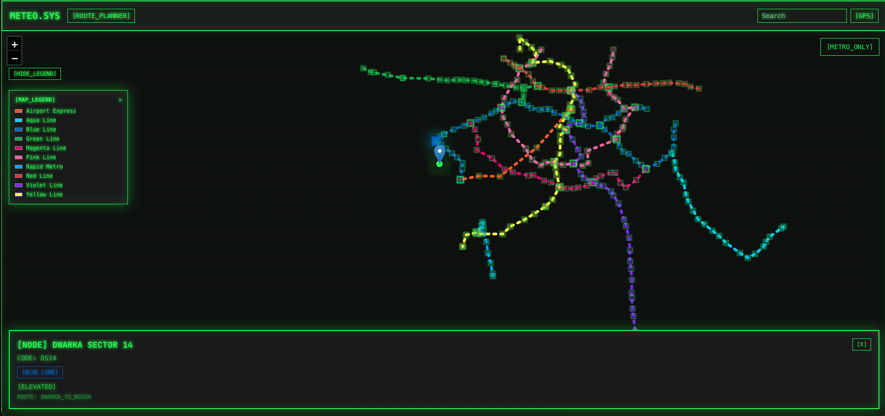

# Meteo

The name is not at all derived from météo (which is french for weather) . I just liked the name..

Meteo is a hobby project , I am still working on data about elevation and stuff but the core is working ig.

## Features (added already or to be added)

### **Live Route Tracking**
- GPS-based real-time position tracking on metro routes
- Automatic tunnel detection when GPS signal is lost
- Visual indicators for underground/elevated stations

### **Smart Interchange Handling**
- Detects stations with multiple metro lines
- Prompts users to select their line at interchange stations
- Auto-detection based on movement patterns

### **Detailed Station Information**
- Station codes, names, and line information
- Entry/exit gate details
- Facilities (washrooms, lifts, parking)
- Nearby landmarks

## Tech Stack

- **Frontend**: React 18 with Vite
- **Maps**: Leaflet.js with React-Leaflet
- **Styling**: TailwindCSS
- **PWA**: Vite PWA plugin
- **Data**: GeoJSON format for metro network data

## Current Coverage

### Delhi Metro (DMRC)
- **10 Lines** with complete station data
- **250+ Stations** with coordinates and metadata
- **Interchange detection** and line mapping

## Usage

1. **Open the app** and allow location permissions
2. **View your position** on the metro map in real-time
3. **Tap stations** to view detailed information
4. **Navigate confidently** with tunnel detection and offline support

## Roadmap

- [ ] **Enhanced tunnel detection**
- [ ] **Multi-city support** 
- [ ] **Community contributions** for station metadata
- [ ] **Real-time service updates** integration
- [ ] **Station facilities** and depth information

## License

I don't think i will need that

## Acknowledgments

- Delhi Metro Rail Corporation (DMRC) for public transit data
- OpenStreetMap contributors for geographic data
- React and Leaflet.js communities

## Note for the file dmrc.json
This was populated via scripts and is available as a public infrastructure information. I used google maps and corrected each and every coordinate. These are all correct as of now.
Hope it helps someone else.

---

**Built in a day**
